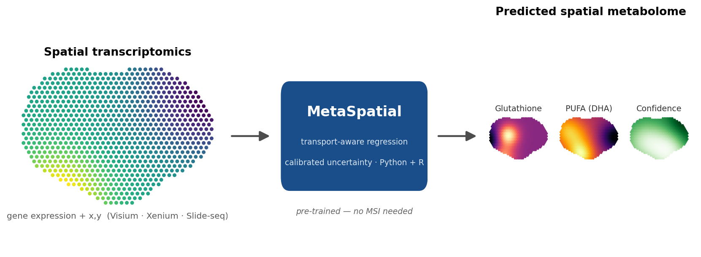

<!-- omit in toc -->
# MetaSpatial

[](LICENSE)
[](https://www.python.org)
[](#use-it-on-your-own-data)
[](#)

**Predict the spatial metabolome from spatial transcriptomics.**

MetaSpatial learns a **gene → metabolite** map from paired tissue sections and then *predicts* the per‑spot metabolite profile for **transcriptome‑only** tissue — with calibrated, out‑of‑distribution‑aware uncertainty. A pre‑trained model ships with the package, so you can go from a Visium/Xenium/Slide‑seq section to predicted metabolite maps in a few lines, with **no mass‑spectrometry data required**.



- [Why MetaSpatial](#why-metaspatial)
- [Installation](#installation)
- [Quick start](#quick-start)
- [Use it on your own data](#use-it-on-your-own-data)
- [Input data format](#input-data-format)
- [How it works](#how-it-works)
- [Datasets](#datasets)
- [Citation](#citation)
- [License](#license)

## Why MetaSpatial

Spatial transcriptomics is abundant; spatial metabolomics is scarce and hard to acquire. Existing tools only *correlate* the two modalities where both were measured — they cannot be applied to the thousands of transcriptome‑only sections where a metabolic readout is actually needed. MetaSpatial is, to our knowledge, the first tool that **predicts** metabolite abundances from transcriptome alone.

- **Predicts** a full per‑spot metabolite (m/z) profile from gene expression + coordinates.
- **Reports its uncertainty** — the shipped model carries split‑conformal per‑metabolite interval widths (attached to the query as `.uns['metaspatial_conf_width']`), and every prediction records the query‑vs‑training gene‑panel overlap (`model.last_gene_overlap_`) as a species/panel out‑of‑distribution guard.
- **Honest about what is predictable** — accuracy is chemical‑class dependent (structural lipids and nucleotides are recoverable; fast‑turnover polar metabolites such as lactate are not), and the model reports this per ion rather than hiding it in an average.
- **Python and R** — one pickled model, called from either language, with byte‑identical results.
- **Lightweight** — CPU‑only `scikit‑learn`; trains and predicts in seconds to minutes.

Transport‑aware features (gene principal components diffused over the spatial neighbourhood graph) give the model its name; a separately verified mass‑conserving reaction–diffusion solver is included to seed future physics‑coupled prediction but is **not** used by the released model.

## Installation

```bash
git clone https://github.com/himanshushekhar367-sudo/MetaSpatial.git
cd MetaSpatial

# option A — conda
conda env create -f environment.yml
conda activate metaspatial
pip install -e .

# option B — pip only
pip install -r requirements.txt
pip install -e .

# option C — reproduce byte-identically (pinned versions the shipped model was built with)
pip install -r requirements-lock.txt
pip install -e .
```

> For results that match the paper exactly, install from `requirements-lock.txt` (option C). The shipped
> `metaspatial_model.pkl` was pickled under the versions pinned there; loading under other versions still
> works but may emit a scikit‑learn `InconsistentVersionWarning`.

Python ≥ 3.9, CPU only (no GPU). For the R interface, install [`reticulate`](https://rstudio.github.io/reticulate/) and point it at the same environment.

## Quick start

A pre‑trained model (`metaspatial_model.pkl`, trained once on the 7‑section DESIUM human‑cancer cohort) ships with the repo. Predicting on your own transcriptome‑only section takes three lines:

```python
import anndata as ad
from metaspatial import MetaSpatial

model = MetaSpatial.load("metaspatial_model.pkl")     # pre-trained; no MSI needed
adata = ad.read_h5ad("your_section.h5ad")             # genes (symbols) + adata.obsm['spatial']
pred  = model.predict_metabolome(adata)               # (n_spots × n_metab); also in adata.obsm['metaspatial_pred']
```

Prediction returns the metabolite matrix, stores it in `adata.obsm['metaspatial_pred']`, and attaches per‑metabolite confidence intervals. Genes are matched by symbol and the transport graph is built per section automatically.

## Use it on your own data

**Python — Visium / Xenium / MERFISH / Slide‑seq `.h5ad`:**

```bash
python examples/predict_on_your_data.py --model metaspatial_model.pkl --query your_section.h5ad --out results/ --plot
```

**R / Seurat — a `.RDS` object, no conversion needed:**

```r
source("R/metaspatial.R")
model <- ms_load_model("metaspatial_model.pkl")
seu   <- ms_run_rds("your_section.RDS", model)   # adds a 'metaspatial' assay
```

Both entry points call the **same** pickled model — the R wrapper dispatches to Python through `reticulate`, so R and Python predictions are byte‑identical. You get a ranked `predicted_metabolites.csv` and spatial maps; the step checks gene/species overlap and warns on mismatch.

> **Read the caveats.** Predictions are strongest for lipids, nucleotides and redox metabolites, and for tissue resembling the human‑tumour training data. Fast‑turnover polar species (lactate, glucose) are deliberately flagged as unpredictable rather than guessed. See [`docs/USAGE.md`](docs/USAGE.md) and the [model card](MODEL_CARD.md).

### Reliability & safe use

Every prediction ships with a per‑ion reliability report — the recommended user‑facing output:

```python
pred = model.predict_metabolome(adata)
rel  = model.reliability_table(adata)   # DataFrame: mz, pred_mean/std, conf_width,
                                        # train_predictability, annotation, class, trust_tier
```

Treat a prediction as **usable** (not just hypothesis‑generating) only when **all** of these hold — otherwise report it as a hypothesis:

1. input tissue resembles the training tissue (human tumour / epithelial);
2. gene‑panel overlap above ~0.5 (`model.last_gene_overlap_`; a warning fires below that);
3. the ion's class is lipid / nucleotide / redox / locally‑synthesised;
4. the predicted map is spatially structured (not random);
5. the ion's `trust_tier` is `medium` or `high` (conformal width narrow, held‑out predictability positive).

Outputs are **2,086 m/z ion channels, not confirmed named metabolites** — exact‑mass annotations are putative and should be treated as hypotheses until MS/MS or FDR‑controlled annotation (e.g. METASPACE) confirms them. Cross‑tissue/cross‑sample transfer is weak by design (see the model card); MetaSpatial predicts *within‑domain, spatially‑structured, transcriptionally‑programmed* metabolite classes, not universal metabolomics.

To train MetaSpatial on **your own** paired MSI + transcriptomics instead of using the shipped model:

```python
from metaspatial import MetaSpatial
model = MetaSpatial(use_kegg=True).fit(train_adatas)   # list of paired AnnData (see below)
model.save("my_model.pkl")
```

## Input data format

One `AnnData` (`.h5ad`) per section. For **prediction** you only need the gene expression and coordinates; the `msi` fields are required only for **training**.

| field | contents | shape | needed for |
|---|---|---|---|
| `adata.layers['log1p']` (or `adata.X`) | genes, `log1p(CP10k)` | `n_spots × n_genes` | predict + train |
| `adata.obsm['spatial']` | x, y coordinates | `n_spots × 2` | predict + train |
| `adata.uns['msi']` | metabolite ion intensities | `n_spots × n_metab` | train only |
| `adata.uns['mz_features']` | m/z values | `n_metab` | train only |

## How it works

Gene expression is reduced to principal components, then augmented with **transport‑aware features** — the components diffused over a spatial k‑nearest‑neighbour graph (`[P, ÂP, ²P]`), a lightweight surrogate for nutrient transport — and an optional KEGG metabolic‑pathway prior. A multi‑output ridge model maps these features to metabolite intensities, and split‑conformal calibration adds per‑metabolite uncertainty. Evaluation uses spatially‑blocked cross‑validation and leave‑one‑section‑out transfer (never random‑spot splits, which inflate accuracy through spatial autocorrelation).

The central empirical finding is a **map of predictability**: which parts of the metabolome are recoverable from transcription (structural lipids, nucleotides, locally‑synthesised neurotransmitters) versus which are not (fast‑flux polar metabolites), reproduced across two ionisation platforms (DESI‑MSI and MALDI‑MSI) and two species.

### Human metabolic map (KEGG prior)

The model can be augmented with an explicit **human metabolic map** — 85 KEGG metabolic pathways over ~1,700 human gene symbols (`data/genesets/scMetab_KEGG.gmt`, shipped with the repo). With `use_kegg=True` the map loads automatically (no path needed): per‑pathway activity scores (mean‑z of member genes, plus one neighbourhood‑diffused copy) are concatenated to the transport features, so the ridge sees explicit gene→metabolite biosynthetic signals rather than only correlational principal components.

```python
model = MetaSpatial(use_kegg=True).fit(train_adatas)   # zero-config human KEGG prior
```

Under the identical detection‑matched leave‑one‑section‑out protocol on the 7‑section DESIUM cohort (the exact numbers in manuscript Supplementary Table S12), the prior gives a **small but statistically supported** lift, concentrated where biosynthetic constraint is tightest:

| stratum | Spearman ρ, no prior | Spearman ρ, +KEGG | Δ |
|---|---|---|---|
| overall (per‑section median) | +0.028 | +0.033 | **+0.0045** (95% CI [+0.001, +0.009]; 6/7 sections improve) |
| nucleotides (n=8) | +0.171 | +0.192 | +0.021 |
| lipids (n=12) | +0.059 | +0.080 | +0.021 |
| fast‑flux polar (n=19) | +0.069 | +0.071 | +0.002 |

The gain is largest for nucleotides and lipids and near‑zero for fast‑flux polar species — the prior sharpens the predictability boundary rather than uniformly inflating scores. (Overall values are the mean of per‑section detection‑matched median Spearman; per‑class values are mean per‑ion Spearman over the seven held‑out folds.) The **shipped `metaspatial_model.pkl` is trained without the prior** (`use_kegg=False`) so it reproduces the manuscript figures byte‑identically; `use_kegg=True` is an opt‑in you retrain for your own tissue.

Because MetaSpatial also predicts measured metabolites, the same map supports **metabolite‑grounded pathway activity** (`metaspatial.MetabolicActivity`): a pathway scores high only where its enzymes *and* its predicted metabolites agree, and each pathway is ranked by enzyme–metabolite spatial coherence (on DESIUM, *Biosynthesis of unsaturated fatty acids* ranks top at ρ≈0.30) — a confidence signal enzyme‑only tools (scMetabolism, AUCell) cannot provide.

## Datasets

MetaSpatial is validated on public paired data — see [`data/README.md`](data/README.md) for download instructions.

| Cohort | Assay | Tissue | DOI |
|---|---|---|---|
| **DESIUM** | DESI‑MSI + Visium | human breast / lung tumour | [10.7910/DVN/GZFCWC](https://doi.org/10.7910/DVN/GZFCWC) (Godfrey et al. 2025) |
| **SMA** | MALDI‑MSI + Visium | mouse & human brain | [10.17632/w7nw4km7xd.1](https://doi.org/10.17632/w7nw4km7xd.1) (Vicari et al. 2024) |

## Citation

If you use MetaSpatial, please cite the accompanying manuscript (details on publication) and the paired datasets above.

```bibtex
@software{metaspatial,
  title  = {MetaSpatial: transport-aware prediction of spatial metabolomes from spatial transcriptomics},
  year   = {2025},
  url    = {https://github.com/himanshushekhar367-sudo/MetaSpatial}
}
```

## License

[MIT](LICENSE).
